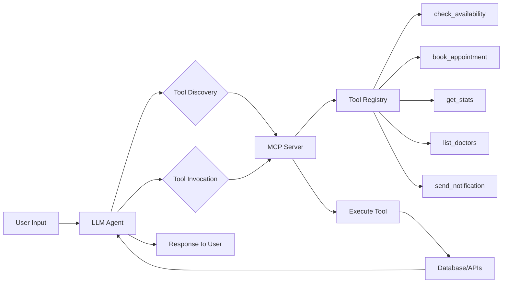

# MediAssist - Agentic AI Doctor Appointment & Reporting System (Full Stack)

Built with **FastAPI**, **React**, **PostgreSQL**, and **Google Gemini** (Agentic AI with MCP).

## 📌 Project Overview
MediAssist is an intelligent assistant that allows:
1.  **Patients**: To book appointments with specialists via natural language chat ("Find me a Cardiologist and book for 10 AM").
2.  **Doctors**: To receive real-time notifications on Slack and query their schedule ("How many patients do I have today?").

The system uses **Model Context Protocol (MCP)** principles where the AI autonomously discovers and triggers backend tools (Database queries, Google Calendar API, Slack Webhooks).

## 🌟 Key Features
*   **Agentic AI Workflow**: The LLM decides when to search for doctors, check availability, or finalize a booking based on context.
*   **Intelligent Doctor Filtering**: Users can ask for "Heart Specialist" and the AI filters for "Cardiologist" effectively.
*   **Real-time Notifications**: Validated integration with **Slack** for instant doctor alerts.
*   **Google Calendar Sync**: Automatically creates calendar events for booked slots.
*   **Aesthetic UI**: A polished, minimal, and responsive chat interface.
*   **Robust Backend**: Async SQLAlchemy with a self-correcting validation layer.

## 🛠️ Tech Stack
*   **Frontend**: React + Vite (Modern "Floating Card" Chat UI)
*   **Backend**: FastAPI, AsyncPG, SQLAlchemy, Pydantic
*   **AI/LLM**: Google Gemini Flash (via `google-genai` SDK)
*   **MCP**: Model Context Protocol for tool orchestration
*   **Database**: PostgreSQL
*   **Tools/Integrations**: Slack Webhooks, Google Calendar API

## 🤖 Agentic AI Architecture

### What Makes This "Agentic"?

This system demonstrates **true agentic AI behavior** - the LLM autonomously:
- **Discovers** available tools via MCP protocol
- **Decides** which tools to invoke based on natural language
- **Chains** multiple tools together (e.g., check availability → book → notify)
- **Maintains** conversation context across multiple turns
- **Asks** clarifying questions when information is missing

### MCP (Model Context Protocol) Integration

The system implements MCP for formal tool orchestration:



**Key MCP Components:**
1. **MCP Server** ([`app/mcp/server.py`](backend/app/mcp/server.py))
   - Exposes tools via `@server.list_tools()`
   - Handles invocation via `@server.call_tool()`
   - Protocol-compliant tool discovery

2. **Agent Service** ([`app/services/llm_service.py`](backend/app/services/llm_service.py))
   - Multi-turn conversation management
   - Dynamic tool selection and chaining
   - Context persistence via `ConversationSession`

3. **Business Logic** ([`app/services/mcp_tools.py`](backend/app/services/mcp_tools.py))
   - 5 core tools for appointment management
   - Integration with external APIs (Gmail, Calendar, Slack)

### Multi-Turn Conversation Example

```
Turn 1:
User: "Is Dr. Ahuja available tomorrow?"
AI: "Dr. Ahuja has slots at 9 AM, 11 AM, and 2 PM tomorrow."

Turn 2:
User: "Book 11 AM"  ← AI remembers doctor and date
AI: "Great! What's your name?"

Turn 3:
User: "John Doe"
AI: "And your email address?"

Turn 4:
User: "john@example.com"
AI: "What's the reason for your visit?"

Turn 5:
User: "Fever"
AI: "✅ Appointment booked for John Doe with Dr. Ahuja tomorrow at 11 AM. 
     Confirmation sent to john@example.com"
```

### Available MCP Tools

| Tool | Purpose | Example Usage |
|------|---------|---------------|
| `check_doctor_availability` | Query available slots | "Is Dr. Smith free tomorrow?" |
| `book_appointment` | Create booking + email + calendar | "Book 10 AM for John" |
| `get_appointment_stats` | Generate reports | "How many patients today?" |
| `list_doctors` | Show available doctors | "Find me a cardiologist" |
| `send_doctor_notification` | Slack alerts | Auto-triggered on booking |

### Tool Chaining Example

When a user says: **"Book Dr. Smith tomorrow at 10 AM for fever"**

The agent autonomously:
1. Calls `check_doctor_availability(doctor="Dr. Smith", date="tomorrow")`
2. Verifies 10 AM is available
3. Calls `book_appointment(time="10:00", reason="fever")`
4. Calls `send_doctor_notification(message="New booking: 10 AM")`
5. Responds to user with confirmation

**No hardcoded workflow** - the LLM decides the sequence!

### Premium Slack UI notifications (Block Kit)

The system doesn't just send text; it delivers **professional healthcare cards** to doctors via Slack:
- **Color-Coded Sidebar**: Health-green indicators for clarity.
- **Structured Sections**: Clear separation of patient info, time, and reason.
- **AI-Generated Reports**: The agent formats daily/weekly summaries into clean, bulleted lists automatically.

### Architecture Deep Dive

- [**ARCHITECTURE.md**](backend/ARCHITECTURE.md): Technical flow and Mermaid diagrams.
- [**PROJECT_KNOWLEDGE.md**](PROJECT_KNOWLEDGE.md): Full project memory and implementation details.

---

## 🏎️ Interactive Demo

To witness the **Agentic AI** behavior in action, run our pre-configured demo script:

```bash
cd backend
python3 scripts/demo_agent_flow.py
```

**This demo showcases:**
1.  **Tool Discovery**: Proving tools aren't hardcoded.
2.  **Multi-Turn Intelligence**: AI remembering your context across 5+ turns.
3.  **Autonomous Chaining**: One command triggering 4 backend systems.
4.  **Date Resolution**: Converting "tomorrow" into real-world dates.

---

## 🚀 Setup Instructions

### 1. Prerequisites
*   Node.js & npm
*   Python 3.10+
*   PostgreSQL (running locally or via Docker)

### 2. Backend Setup
```bash
cd backend
python3 -m venv venv
source venv/bin/activate
pip install -r requirements.txt

# Configure Environment
# Copy .env.example to .env and add your API keys (Gemini, Slack, DB URL)
```

**Initialize Database & Seed Data:**
```bash
# This applies migrations and seeds 20+ specialist doctors
python scripts/seed_data.py
```

**Run Server:**
```bash
python -m uvicorn app.main:app --reload
```

### 3. Frontend Setup
```bash
cd frontend
npm install
npm run dev
```
Access the app at: `http://localhost:5173`

## 📖 Usage Scenarios

### Scenario 1: Patient Booking
1.  **User**: "Find me a Cardiologist."
    *   **System**: Lists Dr. Sarah Smith (Cardiologist).
2.  **User**: "Book an appointment with her for tomorrow at 10 AM."
    *   **System**: Checks DB for 10:00 AM slot -> Books it -> Sends Slack Notification -> Confirms to user.

### Scenario 2: Doctor Reporting
1.  **Doctor (via Chat)**: "How many appointments do I have today?"
    *   **System**: Queries DB for today's count -> Returns summary.

## 🧪 Testing
The project includes a robust set of 20 seeded doctors including:
*   **Dr. Sarah Smith** (Cardiologist)
*   **Dr. Michael Molar** (Dentist)
*   **Dr. Robert Chen** (Neurologist)
...and more.

## Note on Architecture
*   **Notifications**: Currently configured for Slack (Webhook).

## 📡 API Usage Summary
The backend exposes the following endpoints (via Facade Pattern):

### 1. Chat Interaction
**Endpoint:** `POST /api/chat`
**Description:** Main entry point for the AI agent. Handles intent recognition, tool calling, and response generation.
```bash
curl -X POST "http://localhost:8000/api/chat" \
     -H "Content-Type: application/json" \
     -d '{
           "message": "Find me a dentist",
           "session_id": "test-session-1",
           "user_role": "patient"
         }'
```

### 2. Run Database Migrations
**Endpoint:** `POST /api/admin/db-init`
**Description:** Manually triggers database schema creation and doctor seeding.
```bash
curl -X POST "http://localhost:8000/api/admin/db-init"
```

### 3. Health Check
**Endpoint:** `GET /health`
**Description:** Verifies system status.
```bash
curl "http://localhost:8000/health"
```
