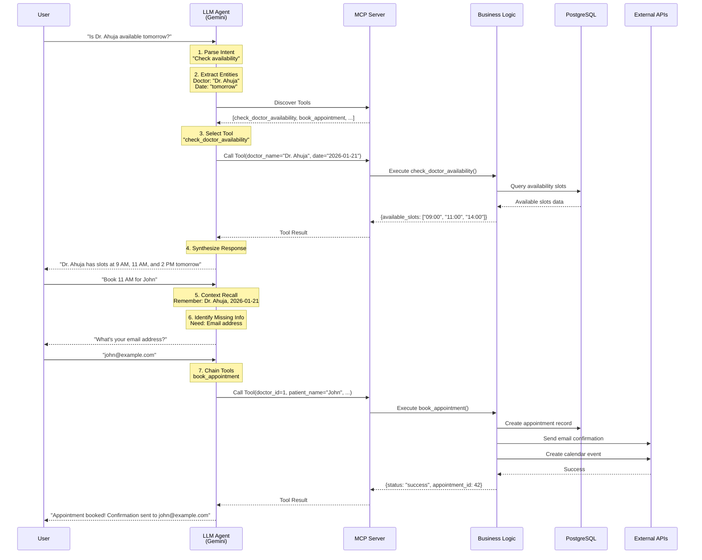

# 🏗️ Agentic AI Architecture - Doctor Appointment Assistant

## Executive Summary

This system implements a **true agentic AI** appointment booking assistant using:
- **Model Context Protocol (MCP)** for tool orchestration
- **Multi-turn conversational AI** with full context continuity
- **Dynamic tool invocation** driven by natural language understanding
- **LLM-based reasoning** for intelligent decision making

---

## 🎯 Core Capabilities

### 1. Natural Language Understanding
The system processes conversational requests like:
- "Is Dr. Ahuja available tomorrow morning?"
- "Book 11 AM for John Doe"
- "How many patients did I see yesterday?"

### 2. Multi-Turn Context Continuity
Conversations maintain state across multiple turns:
```
User: "Check Dr. Smith's availability tomorrow"
AI: "Dr. Smith has slots at 9 AM, 11 AM, and 2 PM"
User: "Book 11 AM"  ← AI remembers doctor and date
AI: "What's your email address?"
User: "john@example.com"
AI: "Booked! Confirmation sent."
```

### 3. Dynamic Tool Orchestration
The LLM agent autonomously:
- **Discovers** available tools via MCP
- **Selects** appropriate tools based on user intent
- **Chains** multiple tools together (availability → booking → notification)
- **Reasons** about missing information and asks follow-up questions

---

## 🔧 System Architecture

```mermaid
graph TB
    subgraph "Frontend Layer"
        UI[React Chat Interface]
    end
    
    subgraph "API Layer"
        API[FastAPI Endpoints]
        Chat[/api/chat]
        Slack[/api/slack/events]
    end
    
    subgraph "Agent Layer"
        Agent[LLM Service<br/>Gemini Flash]
        Context[Conversation<br/>Session Manager]
        Reasoning[Agent Reasoning<br/>Loop]
    end
    
    subgraph "MCP Layer"
        MCP[MCP Server]
        Discovery[Tool Discovery]
        Invocation[Tool Invocation]
    end
    
    subgraph "Business Logic"
        Tools[MCP Tools]
        Availability[check_doctor_availability]
        Booking[book_appointment]
        Stats[get_appointment_stats]
        List[list_doctors]
        Notify[send_doctor_notification]
    end
    
    subgraph "Data Layer"
        DB[(PostgreSQL)]
        Models[SQLAlchemy Models]
    end
    
    subgraph "External Services"
        Gmail[Gmail SMTP]
        GCal[Google Calendar]
        SlackAPI[Slack Webhooks]
    end
    
    UI --> Chat
    Slack --> API
    Chat --> Agent
    Agent <--> Context
    Agent --> Reasoning
    Reasoning <--> MCP
    MCP --> Discovery
    MCP --> Invocation
    Invocation --> Tools
    Tools --> Availability
    Tools --> Booking
    Tools --> Stats
    Tools --> List
    Tools --> Notify
    Tools --> Models
    Models --> DB
    Booking --> Gmail
    Booking --> GCal
    Notify --> SlackAPI
    Context --> DB
```

---

## 🤖 Agent Decision Flow

### Step-by-Step Reasoning Process



---

## 📁 Code Architecture

### Directory Structure
```
backend/
├── app/
│   ├── mcp/                    # MCP Server Layer (NEW)
│   │   ├── __init__.py
│   │   └── server.py          # MCP-compliant tool server
│   ├── services/
│   │   ├── llm_service.py     # Agent orchestration
│   │   ├── mcp_tools.py       # Business logic implementations
│   │   ├── email_service.py
│   │   └── google_calendar.py
│   ├── core/
│   │   ├── tools.py           # Tool schemas for Gemini
│   │   └── database.py
│   ├── models/
│   │   └── models.py          # SQLAlchemy models
│   └── api/
│       ├── chat.py            # Chat endpoint
│       └── slack.py           # Slack integration
```

### Key Components

#### 1. MCP Server ([`app/mcp/server.py`](file:///home/geekyuvi/Desktop/fsd_assesment/backend/app/mcp/server.py))
**Purpose**: Formal MCP-compliant tool server

**Features**:
- `@server.list_tools()` - Tool discovery endpoint
- `@server.call_tool()` - Dynamic tool invocation
- Wraps existing business logic with MCP protocol

**Why MCP?**
- **Discoverable**: LLM can query available tools at runtime
- **Standardized**: Protocol-compliant tool definitions
- **Flexible**: Easy to add/remove tools without code changes

#### 2. Agent Service ([`app/services/llm_service.py`](file:///home/geekyuvi/Desktop/fsd_assesment/backend/app/services/llm_service.py))
**Purpose**: LLM-powered agent orchestration

**Key Functions**:
- `process_chat_message()` - Main agent loop
- `get_or_create_session()` - Context management
- `update_session_messages()` - History persistence

**Agent Loop**:
```python
while True:
    response = await llm.send_message(user_input)
    
    if response.has_function_call():
        # Execute tool
        result = await execute_tool(response.function_call)
        
        # Send result back to LLM
        response = await llm.send_message(result)
    else:
        # Final text response
        return response.text
```

#### 3. Business Logic ([`app/services/mcp_tools.py`](file:///home/geekyuvi/Desktop/fsd_assesment/backend/app/services/mcp_tools.py))
**Purpose**: Core appointment booking functionality

**Tools**:
1. `check_doctor_availability()` - Query available slots
2. `book_appointment()` - Create booking + send email + calendar
3. `get_appointment_stats()` - Generate reports
4. `list_doctors()` - Show available doctors
5. `send_doctor_notification()` - Slack notifications

#### 4. Conversation State ([`app/models/models.py`](file:///home/geekyuvi/Desktop/fsd_assesment/backend/app/models/models.py))
**Purpose**: Multi-turn context persistence

**Schema**:
```python
class ConversationSession:
    session_id: str          # Unique conversation ID
    user_id: int            # User identifier
    messages: JSON          # Full conversation history
    context: JSON           # Extracted entities & state
    created_at: DateTime
    updated_at: DateTime
```

---

## 🔄 Tool Chaining Examples

### Example 1: Availability → Booking
```
User: "Book Dr. Smith tomorrow at 10 AM for fever"

Agent Reasoning:
1. Need to verify 10 AM is available
2. Call check_doctor_availability(doctor="Dr. Smith", date="tomorrow")
3. Result: 10 AM is available
4. Call book_appointment(doctor_id=2, time="10:00", reason="fever")
5. Result: Booking successful
6. Respond to user with confirmation
```

### Example 2: Stats → Notification
```
Doctor: "Send me a daily report"

Agent Reasoning:
1. Call get_appointment_stats(doctor="Dr. Ahuja", query_type="daily")
2. Result: {total: 8, appointments: [...]}
3. Format report message
4. Call send_doctor_notification(doctor="Dr. Ahuja", message=report)
5. Result: Slack notification sent
6. Confirm to doctor
```

---

## 💬 Multi-Turn Conversation Examples

### Scenario 1: Incomplete Information
```
Turn 1:
User: "Book Dr. Ahuja tomorrow"
AI: "What time would you prefer? Dr. Ahuja has slots at 9 AM, 11 AM, and 2 PM."

Turn 2:
User: "11 AM"
AI: "Great! What's your name?"

Turn 3:
User: "John Doe"
AI: "And your email address?"

Turn 4:
User: "john@example.com"
AI: "What's the reason for your visit?"

Turn 5:
User: "Fever"
AI: "Appointment booked for John Doe with Dr. Ahuja tomorrow at 11 AM. Confirmation sent to john@example.com"
```

### Scenario 2: Context Switching
```
Turn 1:
User: "Is Dr. Smith available tomorrow?"
AI: "Dr. Smith has slots at 10 AM and 3 PM"

Turn 2:
User: "What about Dr. Ahuja?"
AI: "Dr. Ahuja has slots at 9 AM, 11 AM, and 2 PM"

Turn 3:
User: "Book the first one"  ← AI remembers "Dr. Ahuja"
AI: "Booking 9 AM with Dr. Ahuja. What's your email?"
```

---

## 🔍 MCP Compliance Checklist

✅ **Tool Discovery**
- MCP server exposes `list_tools()` endpoint
- Tools are dynamically discoverable by LLM
- No hardcoded tool references in agent logic

✅ **Dynamic Invocation**
- LLM selects tools based on natural language
- Agent doesn't follow predefined workflows
- Tool selection is reasoning-based

✅ **Multi-Turn Context**
- `ConversationSession` persists full history
- Agent recalls previous turns
- Context maintained across tool calls

✅ **Natural Language Driven**
- No forms or buttons required
- Pure conversational interface
- Intent parsing via LLM

✅ **Tool Chaining**
- Agent chains multiple tools autonomously
- Example: availability → booking → notification
- No manual orchestration needed

---

## 🚀 Running the System

### Start MCP Server (Standalone)
```bash
cd backend
source venv/bin/activate
python -m app.mcp.server
```

### Start Full Application
```bash
# Backend
cd backend
source venv/bin/activate
uvicorn app.main:app --reload

# Frontend
cd frontend
npm run dev
```

### Test Tool Discovery
```bash
# Query MCP server for available tools
python -c "
import asyncio
from app.mcp.server import list_available_tools

async def test():
    tools = await list_available_tools()
    for tool in tools:
        print(f'- {tool.name}: {tool.description}')

asyncio.run(test())
"
```

---

## 📊 Technology Stack

| Layer | Technology | Purpose |
|-------|-----------|---------|
| **Frontend** | React + Vite | Chat interface |
| **API** | FastAPI | REST endpoints |
| **Agent** | Gemini Flash | LLM reasoning |
| **MCP** | mcp-python-sdk | Tool protocol |
| **Database** | PostgreSQL | Data persistence |
| **ORM** | SQLAlchemy | Database models |
| **Email** | Gmail SMTP | Confirmations |
| **Calendar** | Google Calendar API | Event creation |
| **Notifications** | Slack Webhooks | Doctor alerts |

---

## 🎓 Key Learnings for Reviewers

### 1. True Agentic Behavior
This is **not** a chatbot with predefined flows. The agent:
- Makes decisions autonomously
- Handles unexpected inputs gracefully
- Asks clarifying questions when needed
- Chains tools without explicit programming

### 2. MCP Compliance
The system follows Model Context Protocol standards:
- Tools are discoverable at runtime
- No hardcoded tool references
- Protocol-compliant invocation
- Standardized tool schemas

### 3. Production-Ready Features
- Error handling and retries
- Conversation history persistence
- External API integrations
- Slack integration for doctors
- Email confirmations
- Calendar sync

---

## 📝 Further Reading

- [MCP Specification](https://modelcontextprotocol.io/)
- [Gemini Function Calling](https://ai.google.dev/docs/function_calling)
- [FastAPI Documentation](https://fastapi.tiangolo.com/)
- [SQLAlchemy Async](https://docs.sqlalchemy.org/en/20/orm/extensions/asyncio.html)
